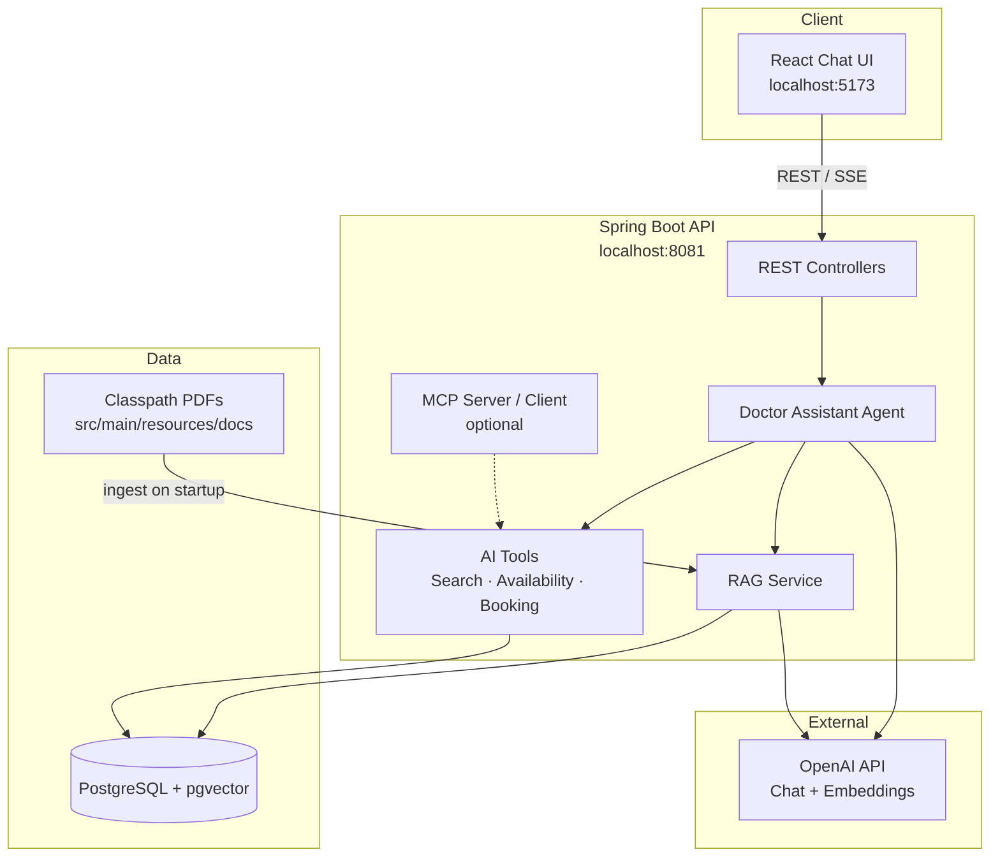

# Doctor Assistant

AI-powered conversational assistant for **Super Clinic** that helps patients find doctors, check availability, book appointments, and retrieve clinic knowledge (FAQs, policies, insurance, and doctor profiles).

Built as a production-oriented reference implementation using **Spring Boot 3**, **Spring AI**, **PostgreSQL + pgvector**, and a **React** chat UI.

| | |
|---|---|
| **Version** | `0.1.0-SNAPSHOT` |
| **Java** | 21 |
| **Backend** | Spring Boot 3.5, Spring AI 1.0 |
| **Frontend** | React 19, Vite, TypeScript, Material UI |
| **Database** | PostgreSQL 16+ with pgvector |

---

## Table of Contents

- [Overview](#overview)
- [Features](#features)
- [Architecture](#architecture)
- [Technology Stack](#technology-stack)
- [Prerequisites](#prerequisites)
- [Quick Start](#quick-start)
- [Configuration](#configuration)
- [API Reference](#api-reference)
- [AI Agent & Tools](#ai-agent--tools)
- [RAG Knowledge Base](#rag-knowledge-base)
- [MCP Integration](#mcp-integration)
- [Project Structure](#project-structure)
- [Database & Migrations](#database--migrations)
- [Sample Data](#sample-data)
- [Testing](#testing)
- [Profiles & Deployment Notes](#profiles--deployment-notes)
- [Troubleshooting](#troubleshooting)

---

## Overview

Doctor Assistant combines a **tool-calling LLM agent** with a **retrieval-augmented generation (RAG)** pipeline over clinic documents. Patients interact through a streaming chat interface; the backend orchestrates OpenAI chat completions, structured tool calls against clinic data, and semantic search over embedded knowledge.

The system is designed for:

- **Accurate scheduling** — live doctor search, availability lookup, and appointment booking from database state (never hallucinated slots).
- **Grounded answers** — FAQs, appointment policies, insurance summaries, and doctor profiles retrieved from a vector store.
- **Session continuity** — persistent conversation sessions and message history per patient.
- **Enterprise patterns** — layered architecture, Flyway migrations, typed configuration, OpenAPI docs, Actuator health/metrics, and integration tests with Testcontainers.

---

## Features

| Capability | Description |
|---|---|
| **Doctor search** | Find doctors by name or specialty (fuzzy specialty matching). |
| **Availability** | Query open slots for a doctor, suggest alternative dates, or find any doctor in a specialty with open slots. |
| **Appointment booking** | Book and cancel appointments with slot locking and validation. |
| **Symptom guidance** | Recommend specialties based on symptoms (informational, not a diagnosis). |
| **RAG knowledge** | Semantic search over PDF and database-backed clinic documents. |
| **Streaming chat** | Server-Sent Events (SSE) for real-time assistant responses. |
| **Session management** | Create, resume, list, and close conversation sessions. |
| **MCP (optional)** | Expose or consume tools via Model Context Protocol. |

---

## Architecture



**Request flow (chat message):**

1. Frontend sends the patient message to `/api/v1/conversations/{sessionId}/messages/stream`.
2. RAG retrieves relevant knowledge chunks and augments the prompt.
3. The agent calls OpenAI with registered tools and conversation memory.
4. Tools query PostgreSQL for doctors, slots, and bookings.
5. The response is streamed back to the client as JSON-encoded SSE chunks.

---

## Technology Stack

### Backend

| Component | Technology |
|---|---|
| Runtime | Java 21 |
| Framework | Spring Boot 3.5 |
| AI | Spring AI 1.0 (OpenAI chat + embeddings) |
| Vector store | pgvector (HNSW, cosine distance) |
| Persistence | Spring Data JPA, Flyway |
| API docs | SpringDoc OpenAPI / Swagger UI |
| Observability | Spring Boot Actuator (health, metrics, prometheus) |
| PDF ingestion | Spring AI PDF Document Reader (Apache PDFBox) |
| Testing | JUnit 5, Mockito, Spring Boot Test, Testcontainers |

### Frontend

| Component | Technology |
|---|---|
| UI | React 19, TypeScript |
| Build | Vite 8 |
| Components | Material UI 9 |
| API | Fetch + SSE streaming |

---

## Prerequisites

| Requirement | Version / Notes |
|---|---|
| **JDK** | 21+ |
| **Maven** | 3.9+ |
| **Node.js** | 20+ (for frontend) |
| **Docker** | Required for integration tests; recommended for local PostgreSQL |
| **OpenAI API key** | Chat model + embedding model access |

---

## Quick Start

### 1. Start PostgreSQL with pgvector

Run a PostgreSQL instance with the `vector` extension enabled. Example using Docker:

```bash
docker run -d \
  --name doctor-assistant-db \
  -e POSTGRES_USER=postgres \
  -e POSTGRES_PASSWORD=postgres \
  -e POSTGRES_DB=doctor_assistant \
  -p 5433:5432 \
  pgvector/pgvector:pg16
```

> **Note:** Port `5433` avoids conflicts with a local PostgreSQL installation on `5432`. Adjust `DATABASE_URL` if you use a different port.

Flyway migrations run automatically on backend startup and enable required extensions (`pgcrypto`, `vector`, `btree_gist`).

### 2. Configure environment variables

Create a `.env` file in the project root (never commit secrets):

```bash
SPRING_PROFILES_ACTIVE=dev
SERVER_PORT=8081

DATABASE_URL=jdbc:postgresql://localhost:5433/doctor_assistant
DATABASE_USERNAME=postgres
DATABASE_PASSWORD=postgres

OPENAI_API_KEY=sk-your-key-here
OPENAI_CHAT_MODEL=gpt-4.1-mini
OPENAI_EMBEDDING_MODEL=text-embedding-3-small

CORS_ALLOWED_ORIGINS=http://localhost:5173,http://localhost:3000
```

Load variables into your shell before starting the backend (PowerShell example):

```powershell
Get-Content .env | ForEach-Object {
  if ($_ -match '^([^=]+)=(.*)$') {
    Set-Item -Path "env:$($matches[1].Trim())" -Value $matches[2].Trim().Trim('"')
  }
}
```

### 3. Start the backend

```bash
mvn spring-boot:run -DskipTests
```

| Endpoint | URL |
|---|---|
| API base | http://localhost:8081 |
| Swagger UI | http://localhost:8081/swagger-ui.html |
| Health | http://localhost:8081/actuator/health |

On first startup in the `dev` profile, sample doctors and patients are seeded automatically if the database is empty. PDF knowledge documents are ingested into the vector store when the RAG catalog is empty.

### 4. Start the frontend

```bash
cd frontend
cp .env.example .env
npm install
npm run dev
```

Open **http://localhost:5173**. The Vite dev server proxies `/api` to `http://localhost:8081`.

---

## Configuration

Key settings are externalized via environment variables and `application.yml`. Profile-specific overrides live in `application-dev.yml` and `application-prod.yml`.

### Application

| Variable | Default | Description |
|---|---|---|
| `SPRING_PROFILES_ACTIVE` | `dev` | Active Spring profile |
| `SERVER_PORT` | `8080` | HTTP port (`8081` recommended locally) |

### Database

| Variable | Default | Description |
|---|---|---|
| `DATABASE_URL` | `jdbc:postgresql://localhost:5432/doctor_assistant` | JDBC URL |
| `DATABASE_USERNAME` | `doctor_assistant` | Database user |
| `DATABASE_PASSWORD` | `doctor_assistant` | Database password |
| `DATABASE_POOL_MAX_SIZE` | `20` | HikariCP max pool size |

### OpenAI

| Variable | Default | Description |
|---|---|---|
| `OPENAI_API_KEY` | — | **Required.** API key |
| `OPENAI_CHAT_MODEL` | `gpt-4.1-mini` | Chat completion model |
| `OPENAI_CHAT_TEMPERATURE` | `0.3` | Sampling temperature |
| `OPENAI_EMBEDDING_MODEL` | `text-embedding-3-small` | Embedding model |
| `OPENAI_EMBEDDING_DIMENSIONS` | `1536` | Vector dimensions |

### RAG / pgvector

| Variable | Default | Description |
|---|---|---|
| `RAG_TOP_K` | `5` | Max chunks retrieved per query |
| `RAG_SIMILARITY_THRESHOLD` | `0.55` | Minimum similarity score (dev profile uses `0.0`) |
| `RAG_CLASSPATH_DOCS_ENABLED` | `true` | Load PDFs from classpath |
| `RAG_CLASSPATH_DOCS_LOCATION` | `classpath:docs/*.pdf` | PDF glob pattern |
| `RAG_CLASSPATH_DOCS_AUTO_INGEST` | `true` | Ingest PDFs on startup when catalog is empty |
| `PGVECTOR_INDEX_TYPE` | `HNSW` | Vector index type |
| `PGVECTOR_DISTANCE_TYPE` | `COSINE_DISTANCE` | Distance metric |

### Chat & CORS

| Variable | Default | Description |
|---|---|---|
| `CHAT_MAX_HISTORY_MESSAGES` | `20` | Messages retained in agent context |
| `CORS_ALLOWED_ORIGINS` | `http://localhost:5173,...` | Allowed frontend origins |

### MCP (optional)

| Variable | Default | Description |
|---|---|---|
| `MCP_ENABLED` | `false` | Enable MCP server |
| `MCP_CLIENT_ENABLED` | `false` | Enable MCP client for tool discovery |

---

## API Reference

Interactive documentation is available at `/swagger-ui.html` when the `dev` profile is active (disabled in production by default).

### Conversations

| Method | Path | Description |
|---|---|---|
| `POST` | `/api/v1/conversations` | Start a new session |
| `GET` | `/api/v1/conversations?patientId={uuid}` | List sessions for a patient |
| `GET` | `/api/v1/conversations/{sessionId}/resume` | Resume a session |
| `GET` | `/api/v1/conversations/{sessionId}/messages` | Get message history |
| `POST` | `/api/v1/conversations/{sessionId}/messages` | Send message (non-streaming) |
| `POST` | `/api/v1/conversations/{sessionId}/messages/stream` | Send message (SSE stream) |
| `POST` | `/api/v1/conversations/{sessionId}/close` | Close session |

### RAG

| Method | Path | Description |
|---|---|---|
| `POST` | `/api/v1/rag/ingest` | Ingest all knowledge sources |
| `POST` | `/api/v1/rag/ingest/{sourceType}` | Ingest one source type |
| `GET` | `/api/v1/rag/search?query=...` | Semantic knowledge search |

**Source types:** `DOCTOR_PROFILE`, `FAQ`, `INSURANCE_POLICY`, `APPOINTMENT_POLICY`

### MCP

| Method | Path | Description |
|---|---|---|
| `GET` | `/api/v1/mcp/tools` | List registered MCP tools |

### Actuator

| Path | Description |
|---|---|
| `/actuator/health` | Application health |
| `/actuator/info` | Application info |
| `/actuator/metrics` | Micrometer metrics |
| `/actuator/prometheus` | Prometheus scrape endpoint |

---

## AI Agent & Tools

The agent uses Spring AI tool calling with a strict system prompt: **never invent doctors, slots, or UUIDs** — all live data must come from tool responses.

| Tool | Purpose |
|---|---|
| `findDoctorByName` | Search doctors by name |
| `findDoctorsBySpeciality` | Search doctors by specialty |
| `getAvailability` | Open slots for one doctor on a date |
| `suggestAlternativeSlots` | Alternative dates for one doctor |
| `findDoctorsWithOpenSlots` | Doctors in a specialty with open slots |
| `bookAppointment` | Book an appointment |
| `cancelAppointment` | Cancel an appointment |

The system prompt injects the current UTC date so scheduling queries use correct, non-historical dates.

---

## RAG Knowledge Base

### Document sources

| Source | Origin | Use case |
|---|---|---|
| **Classpath PDFs** | `src/main/resources/docs/*.pdf` | Primary source in development |
| **Database records** | `knowledge_documents` table | Fallback / seed data |
| **Doctor profiles** | Built from `doctors` table or PDF | Background on clinicians |

### Bundled PDF documents

| File | Source type |
|---|---|
| `Clinic_FAQ_Super_Clinic.pdf` | FAQ |
| `Insurance_Policies_Super_Clinic.pdf` | INSURANCE_POLICY |
| `Appointment_Policies_Super_Clinic.pdf` | APPOINTMENT_POLICY |
| `Doctor_Profiles_Super_Clinic.pdf` | DOCTOR_PROFILE |

### Ingestion

- **Automatic:** On startup when `RAG_CLASSPATH_DOCS_AUTO_INGEST=true` and the catalog is empty.
- **Manual:** `POST /api/v1/rag/ingest` after updating PDFs or database content.

Embeddings are stored in the `vector_store` table (pgvector, 1536 dimensions). Ingestion metadata is tracked in `rag_source_catalog`.

---

## MCP Integration

The application supports optional [Model Context Protocol](https://modelcontextprotocol.io/) integration:

- **MCP Server** — Expose doctor search, availability, and booking tools to external MCP hosts (`MCP_ENABLED=true`).
- **MCP Client** — Discover tools from a remote MCP server instead of in-process tools (`MCP_CLIENT_ENABLED=true`).

Both are disabled by default. See `application.yml` under `spring.ai.mcp` and `doctor-assistant.mcp` for endpoints and timeouts.

---

## Project Structure

```
doctor-assistant/
├── pom.xml                          # Maven build
├── src/main/java/com/superclinic/doctorassistant/
│   ├── ai/                          # Agent, tools, RAG, prompts, OpenAI config
│   ├── api/                         # REST controllers (conversation, RAG, MCP)
│   ├── config/                      # CORS, dev data loader
│   ├── domain/                      # Business services (appointments, availability, doctors)
│   ├── integration/mcp/           # MCP server/client wiring
│   └── persistence/                 # JPA entities and repositories
├── src/main/resources/
│   ├── application.yml              # Base configuration
│   ├── application-dev.yml          # Development overrides
│   ├── application-prod.yml         # Production overrides
│   ├── db/migration/                # Flyway SQL migrations (V1–V5)
│   ├── db/sample/                   # Seed and import scripts
│   └── docs/                        # RAG PDF knowledge documents
├── src/test/java/                   # Unit and integration tests
└── frontend/                        # React chat UI (see frontend/README.md)
```

---

## Database & Migrations

Schema is managed exclusively by **Flyway**. Hibernate `ddl-auto` is set to `validate`.

| Migration | Purpose |
|---|---|
| `V1__enable_extensions.sql` | `pgcrypto`, `vector`, `btree_gist` |
| `V2__create_schema.sql` | Core domain tables |
| `V3__spring_ai_chat_memory.sql` | Spring AI chat memory |
| `V4__pgvector_rag_schema.sql` | Vector store and RAG catalog |
| `V5__rag_appointment_policy_source_type.sql` | Appointment policy source type |

Core entities include `patients`, `doctors`, `specialties`, `availability`, `appointments`, `conversation_sessions`, `conversation_history`, `knowledge_documents`, `vector_store`, and `rag_source_catalog`.

---

## Sample Data

| Resource | Location | Purpose |
|---|---|---|
| Full dev seed | `src/main/resources/db/sample/sample_data.sql` | Doctors, patients, slots, FAQs |
| Minimal bootstrap | `src/main/resources/db/sample/dev_bootstrap.sql` | Default patient only |
| Legacy doctor import | `src/main/resources/db/sample/import_legacy_local_doctors.sql` | Import doctors with relative slot dates |

The `DevSampleDataLoader` (dev profile) loads `sample_data.sql` automatically when no doctors exist.

**Default demo patient ID:** `b2000000-0000-4000-8000-000000000001` (Alice Johnson)

To import legacy doctors manually:

```bash
docker exec -i doctor-assistant-db psql -U postgres -d doctor_assistant \
  < src/main/resources/db/sample/import_legacy_local_doctors.sql
```

---

## Testing

Integration tests use **Testcontainers** (PostgreSQL) and require **Docker** to be running.

```bash
# Run all tests
mvn test

# Run integration tests only
mvn test -Dtest="*IntegrationTest"
```

### Scenario coverage

| Scenario | Test class |
|---|---|
| Book appointment | `AppointmentBookingIntegrationTest` |
| Doctor unavailable | `DoctorUnavailableIntegrationTest` |
| Alternative doctor | `AlternativeDoctorIntegrationTest` |
| Symptom recommendation | `SymptomRecommendationIntegrationTest` |
| RAG doctor profile lookup | `RagDoctorProfileIntegrationTest` |
| FAQ lookup | `RagFaqLookupIntegrationTest` |

---

## Profiles & Deployment Notes

| Profile | Purpose |
|---|---|
| `dev` | SQL logging, Swagger enabled, sample data loader, PDF auto-ingest, DevTools |
| `prod` | Minimal logging, Swagger disabled, DevTools off |
| `test` | Testcontainers datasource, MCP disabled, classpath PDF ingest disabled |

**Production checklist:**

- Set `SPRING_PROFILES_ACTIVE=prod`
- Provide secrets via environment or a secrets manager (never commit `.env`)
- Set `SWAGGER_ENABLED=false`
- Configure `CORS_ALLOWED_ORIGINS` for your frontend domain
- Use a managed PostgreSQL instance with pgvector
- Set `RAG_SIMILARITY_THRESHOLD` appropriately for your corpus (start with `0.55`, tune as needed)
- Disable `RAG_CLASSPATH_DOCS_AUTO_INGEST` if ingestion is handled by a pipeline

---

## Troubleshooting

| Symptom | Likely cause | Resolution |
|---|---|---|
| **New chat fails silently** | Missing seed patient / doctors | Restart backend in `dev` profile or run `sample_data.sql` |
| **Stream failed (500)** | Backend error during SSE | Check logs; verify `OPENAI_API_KEY` is valid |
| **No appointment slots** | Wrong date or empty availability | Use current/future dates; run import script to refresh slots |
| **RAG returns no results** | Empty vector store or high similarity threshold | Call `POST /api/v1/rag/ingest`; lower `RAG_SIMILARITY_THRESHOLD` in dev |
| **Port already in use** | Another process on 8080/8081 | Set `SERVER_PORT=8081` or stop the conflicting process |
| **Database connection refused** | PostgreSQL not running or wrong port | Start Docker DB; verify `DATABASE_URL` matches host/port |
| **Integration tests fail** | Docker not running | Start Docker Desktop and re-run `mvn test` |

---

## License

Copyright © Super Clinic. All rights reserved.

---

## Related Documentation

- [Frontend README](frontend/README.md) — React UI setup and component structure
- [Spring AI Reference](https://docs.spring.io/spring-ai/reference/)
- [pgvector](https://github.com/pgvector/pgvector)
