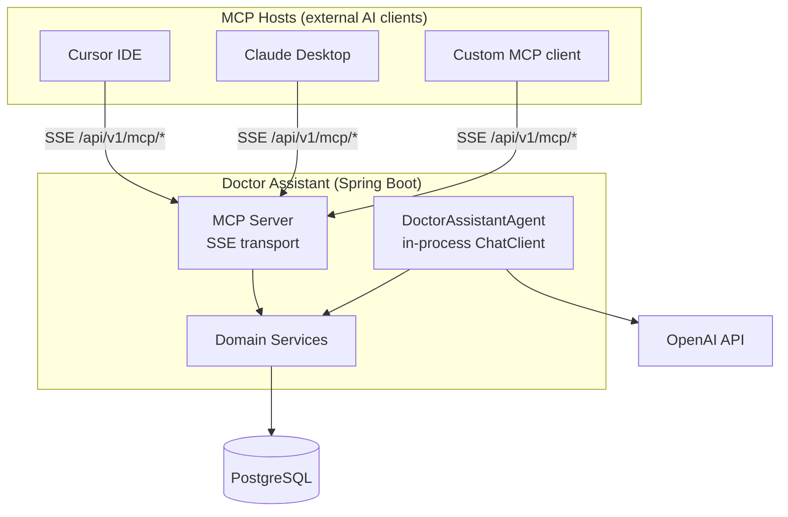
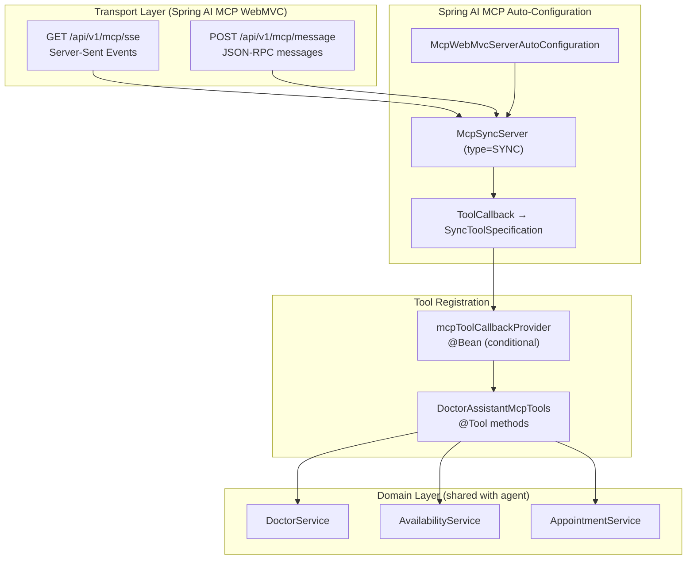
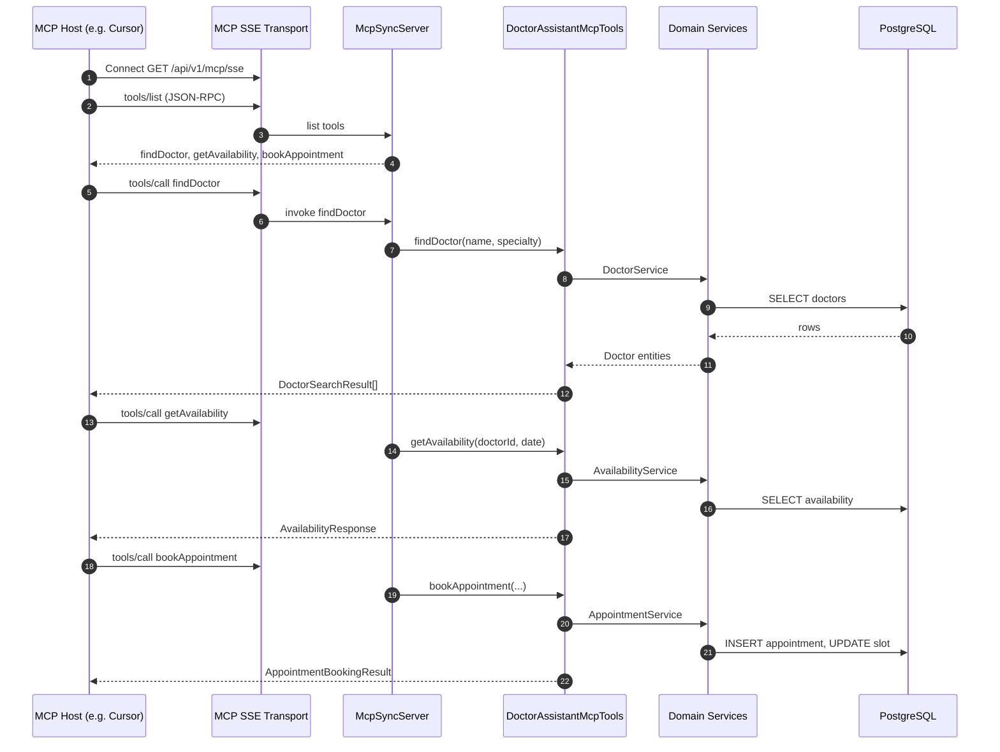
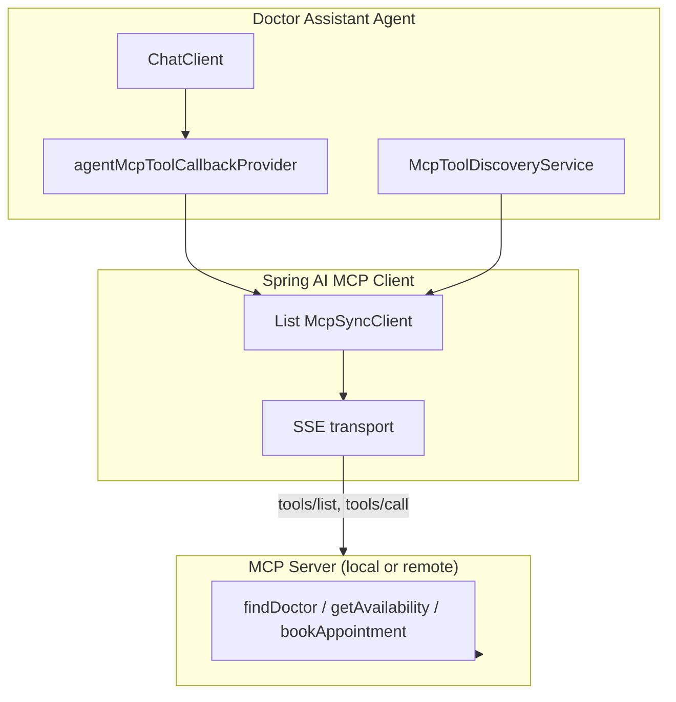
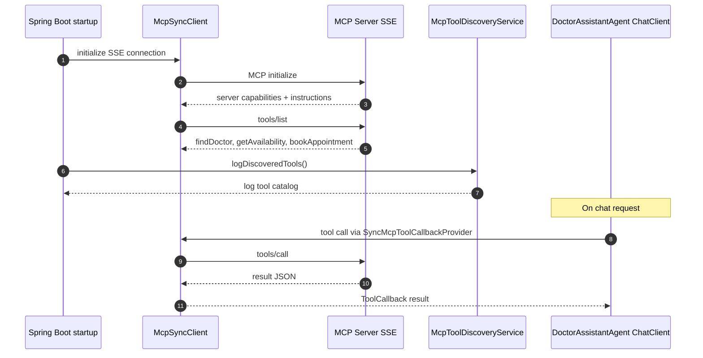

# MCP Server Architecture — Doctor Assistant

Embedded [Model Context Protocol](https://modelcontextprotocol.io/) server exposing Super Clinic booking tools to external AI hosts (Cursor, Claude Desktop, custom agents).

## 1. System Context



## 2. MCP Server Internal Architecture



## 3. Tool Surface

| MCP Tool | Domain delegation | Purpose |
|----------|-------------------|---------|
| `findDoctor` | `DoctorService` | Search by name and/or specialty |
| `getAvailability` | `AvailabilityService` | Open slots for doctor + date |
| `bookAppointment` | `AppointmentService` | Confirm booking with slot UUID |

Agent-only tools (`cancelAppointment`, `suggestAlternativeSlots`, etc.) are **not** exposed via MCP.

## 4. Tool Registration Strategy

Spring AI MCP auto-configuration discovers `ToolCallbackProvider` beans and registers them as MCP tools.

```
DoctorAssistantMcpTools (@Component, @Tool)
        ↓
McpToolRegistrationConfig (@ConditionalOnProperty mcp.enabled=true)
        ↓
@Bean mcpToolCallbackProvider → MethodToolCallbackProvider
        ↓
Spring AI McpServerAutoConfiguration → McpSyncServer
```

**Isolation from agent tools:** In-process agent tools use `AgentToolCallbackFactory` (not a Spring bean). Only `mcpToolCallbackProvider` is registered when MCP is enabled, preventing internal tools from leaking to external clients.

## 5. Spring AI Integration Map

| Concern | Spring AI component | Configuration |
|---------|---------------------|---------------|
| MCP server transport | `spring-ai-starter-mcp-server-webmvc` | SSE endpoints under `/api/v1` |
| Tool definitions | `@Tool` + `@ToolParam` | `DoctorAssistantMcpTools` |
| Tool registration | `MethodToolCallbackProvider` | `McpToolRegistrationConfig` |
| Server lifecycle | `McpServerAutoConfiguration` | `spring.ai.mcp.server.*` |
| Agent (separate) | `ChatClient` + `AgentToolCallbackFactory` | `OpenAiConfig`, `DoctorAssistantAgentConfig` |

## 6. Typical MCP Tool Call Sequence



## 7. Configuration

Enable the embedded MCP server:

```bash
MCP_ENABLED=true
MCP_SERVER_URL=http://localhost:8080/api/v1
```

Key properties (`application.yml`):

| Property | Default | Description |
|----------|---------|-------------|
| `doctor-assistant.mcp.enabled` | `false` | Master switch |
| `spring.ai.mcp.server.enabled` | `${MCP_ENABLED}` | Spring AI MCP server |
| `spring.ai.mcp.server.type` | `SYNC` | Synchronous tool execution |
| `spring.ai.mcp.server.base-url` | `/api/v1` | URL prefix for MCP endpoints |
| `spring.ai.mcp.server.sse-endpoint` | `/mcp/sse` | SSE stream endpoint |
| `spring.ai.mcp.server.sse-message-endpoint` | `/mcp/message` | Client message endpoint |

Full MCP URLs when running locally on port 8080:

- SSE: `http://localhost:8080/api/v1/mcp/sse`
- Messages: `http://localhost:8080/api/v1/mcp/message`

## 8. Client Connection Examples

### Cursor / MCP Inspector

```json
{
  "mcpServers": {
    "doctor-assistant": {
      "url": "http://localhost:8080/api/v1/mcp/sse"
    }
  }
}
```

Verify with MCP Inspector:

```bash
npx @modelcontextprotocol/inspector
```

### Optional: consume this server from another Spring AI app

Add `spring-ai-starter-mcp-client` to the host application:

```yaml
spring.ai.mcp.client.streamable-http.connections.doctor-assistant.url=http://localhost:8080/api/v1
```

The host's auto-configured `ToolCallbackProvider` merges remote MCP tools into its `ChatClient`.

## 9. Package Layout

```
integration/mcp/
├── DoctorAssistantMcpTools.java         # MCP server @Tool definitions
├── McpToolRegistrationConfig.java       # Server ToolCallbackProvider
├── McpClientIntegrationConfig.java      # Agent MCP ToolCallbackProvider
├── McpToolDiscoveryService.java         # tools/list discovery
├── DoctorAssistantMcpClientCustomizer.java
├── McpProperties.java
└── McpServerInstructions.java

api/mcp/
└── McpToolDiscoveryController.java      # GET /api/v1/mcp/tools
```

## 10. MCP Client Integration (Agent Tool Discovery)

When `MCP_CLIENT_ENABLED=true`, the Doctor Assistant Agent discovers tools from an MCP server instead of in-process `@Tool` beans.

### Client Architecture



### Tool Discovery Flow



### Spring AI Client Configuration

| Property | Purpose |
|----------|---------|
| `spring.ai.mcp.client.enabled` | Enable MCP client |
| `spring.ai.mcp.client.type` | `SYNC` (matches agent ChatClient) |
| `spring.ai.mcp.client.toolcallback.enabled` | `false` — agent uses dedicated bean |
| `spring.ai.mcp.client.sse.connections.doctor-assistant.url` | MCP server base URL |
| `spring.ai.mcp.client.sse.connections.doctor-assistant.sse-endpoint` | `/mcp/sse` |

Agent wiring (`DoctorAssistantAgentConfig`):

- **MCP client on** → `defaultToolCallbacks(agentMcpToolCallbackProvider)` + `MCP_SYSTEM_PROMPT`
- **MCP client off** → `defaultTools(...)` in-process beans + `SYSTEM_PROMPT`

### Enable Agent MCP Mode (loopback dev)

```bash
MCP_ENABLED=true          # embedded MCP server
MCP_CLIENT_ENABLED=true   # agent discovers tools via MCP
MCP_SERVER_URL=http://localhost:8080/api/v1
```

Verify discovery:

```bash
curl http://localhost:8080/api/v1/mcp/tools
```

### Remote MCP Server

Connect the agent to an external MCP server without enabling the embedded server:

```bash
MCP_ENABLED=false
MCP_CLIENT_ENABLED=true
MCP_SERVER_URL=https://mcp.superclinic.example/api/v1
```

## 11. Security Considerations (production)

- Place MCP endpoints behind authentication (API key, OAuth, mTLS).
- Restrict network access to trusted MCP hosts.
- Rate-limit `bookAppointment` to prevent abuse.
- Audit-log all MCP tool invocations.
- Do not expose MCP in production without TLS.
